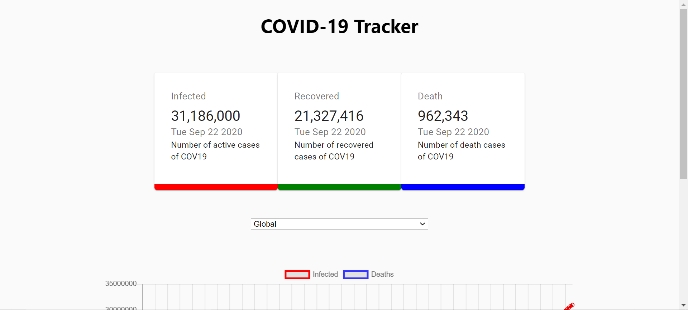
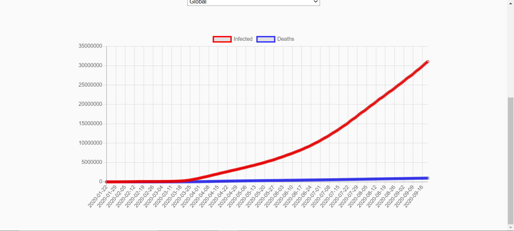
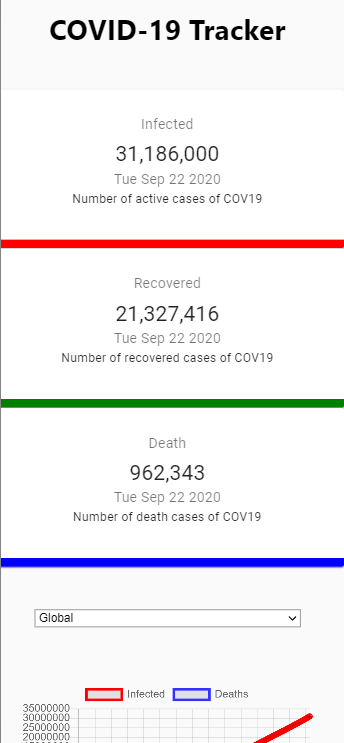

# COVID-19 Tracker
link :https://cov19countrytracker.netlify.app/

## Introduction
React app can track global amount of people infected, recovered, deaths. 

Cov19 API, Material UI, React-Chart, CountUp,etc.

screenshorts:

